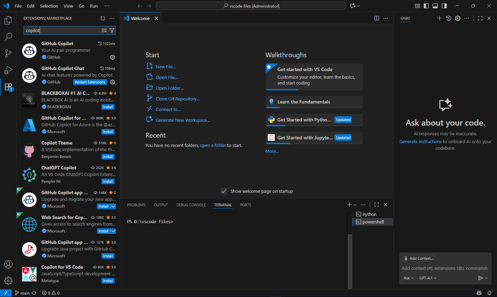
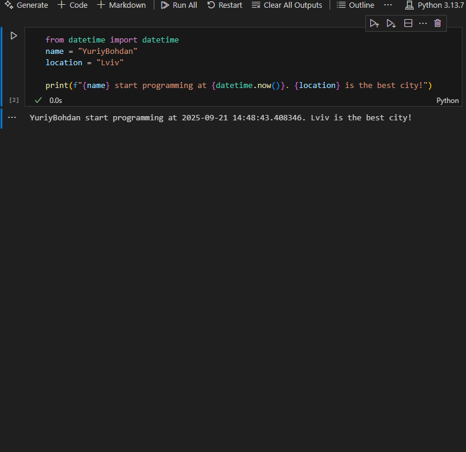

**Звіт до Роботи**

**Тема роботи: Оформлення робіт та перша програма**

**Мета роботи:** 

**1.Виконати всі завдання описані: https://github.com/BobasB/it_college/tree/main/notes/03_results_formatting**

**2.Оформіть звіт роботи згідно шаблону: https://github.com/BobasB/it_college/tree/main/reports**

**Виконання роботи**

**1.Встановлення плагінів VSCode**

**2.Перша програма на Python** 

**3.Програма на Python Notebook** 

**4.Перша програма написана за запитом AI, пояснення його програми** 
