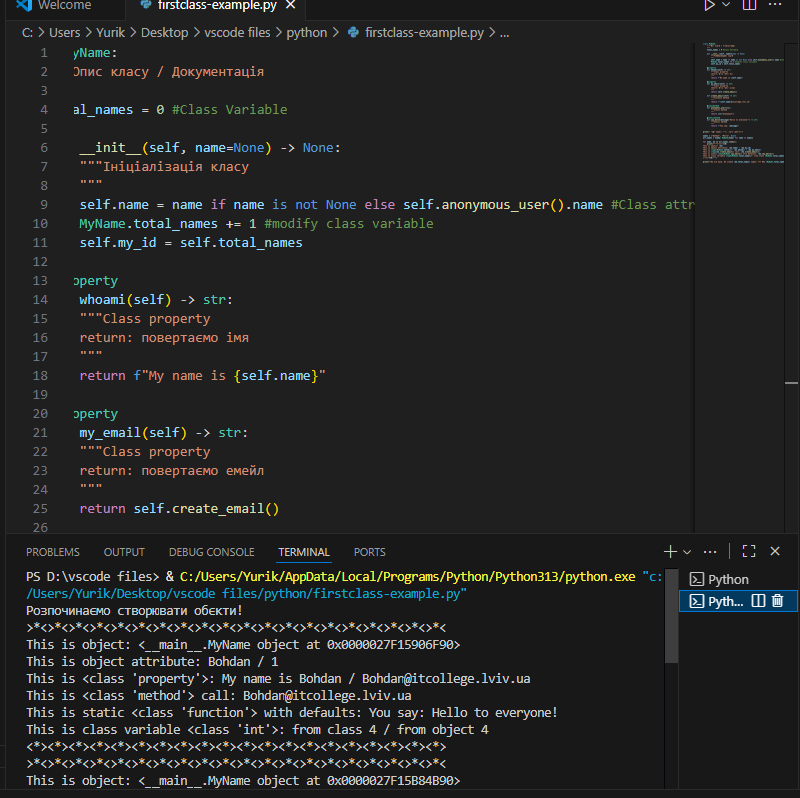

**Звіт до Роботи**

**Тема роботи: Знайомство з ООП**

**Мета роботи:Навчитись використовувати основні принципи ООП, розглянути кострукції побудови класу та створення обєктів та навчитись працювати з ними** 

**1. Виконайте всі завдання описані https://github.com/BobasB/it_college/tree/main/notes/05_OOP_first_class**

**2.Оформіть та здайте роботу. Зразок оформлення можна знайти за
посиланням https://github.com/BobasB/it_college/tree/main/reports**

**3. Вставте посилання на виконану роботу (URL посилання на репозиторій/папку з роботою) у матеріали Завдання або у приватні коментар.**

**Виконання роботи**

**Створюємо перший class**
**Створіть два python файли: для Ноутбука з розширенням .ipynb та для скрипта з розширенням .py;**
**Скопіюйте Python код наведений внизу у Ваш файл з розширенням .py та виконайте його натиснувши Run Python File (трикутник ▶️);**

**Перша програма на ООП**

**1.Вкажіть у звіті що вивела пограма або зробіть скріншот та вставте у звіт;**

