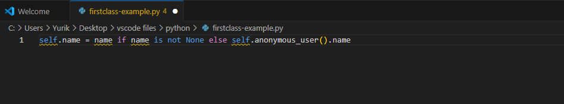
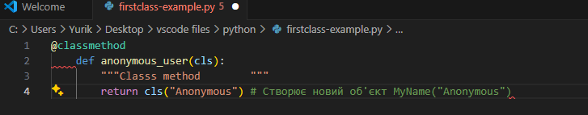
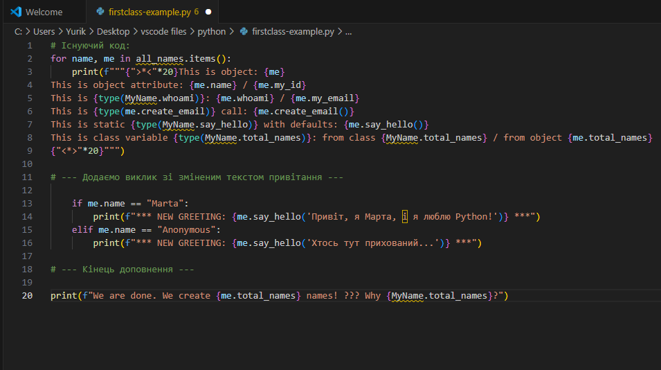
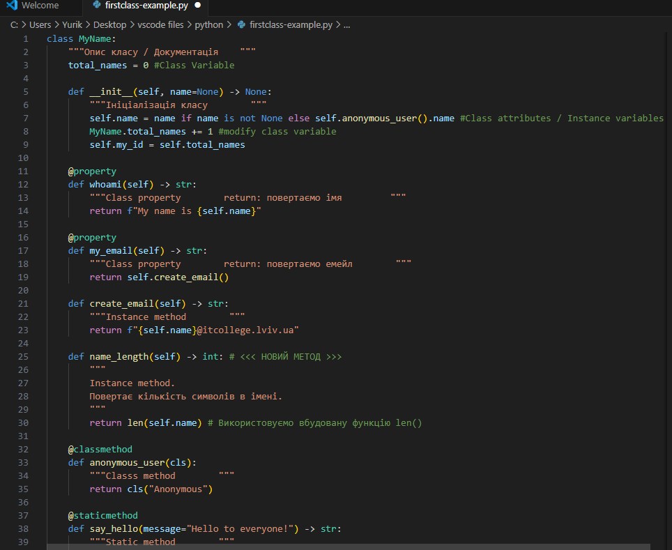
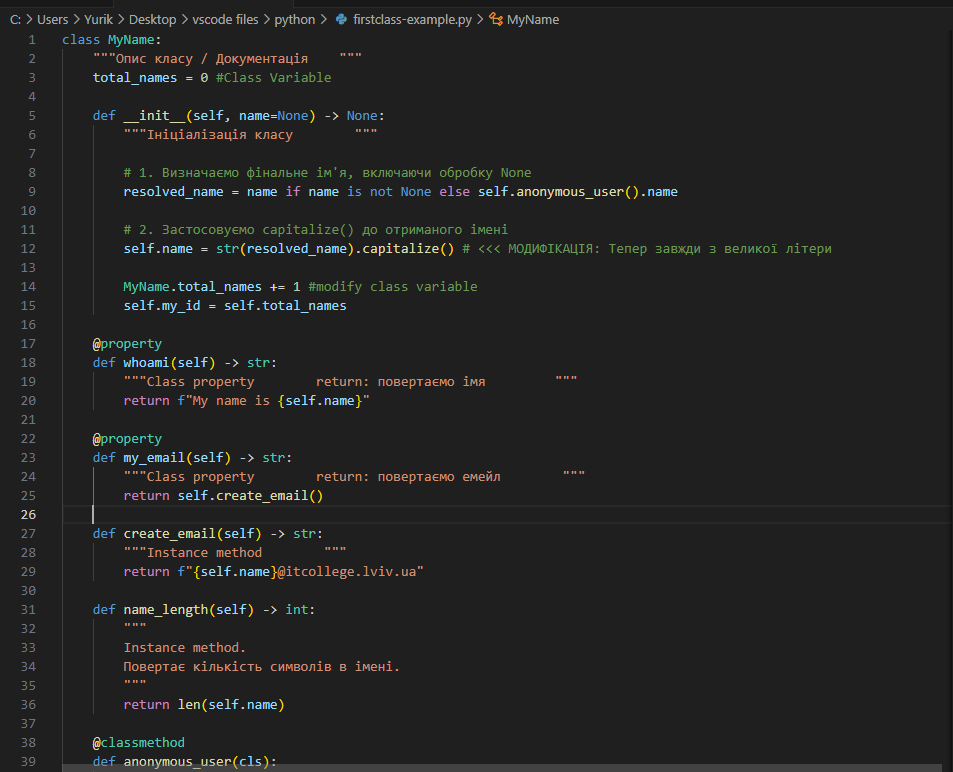
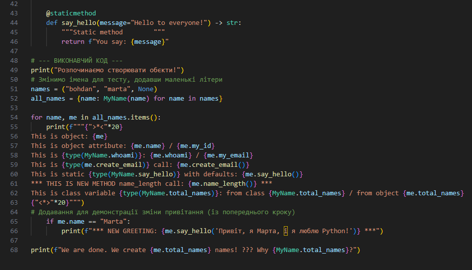
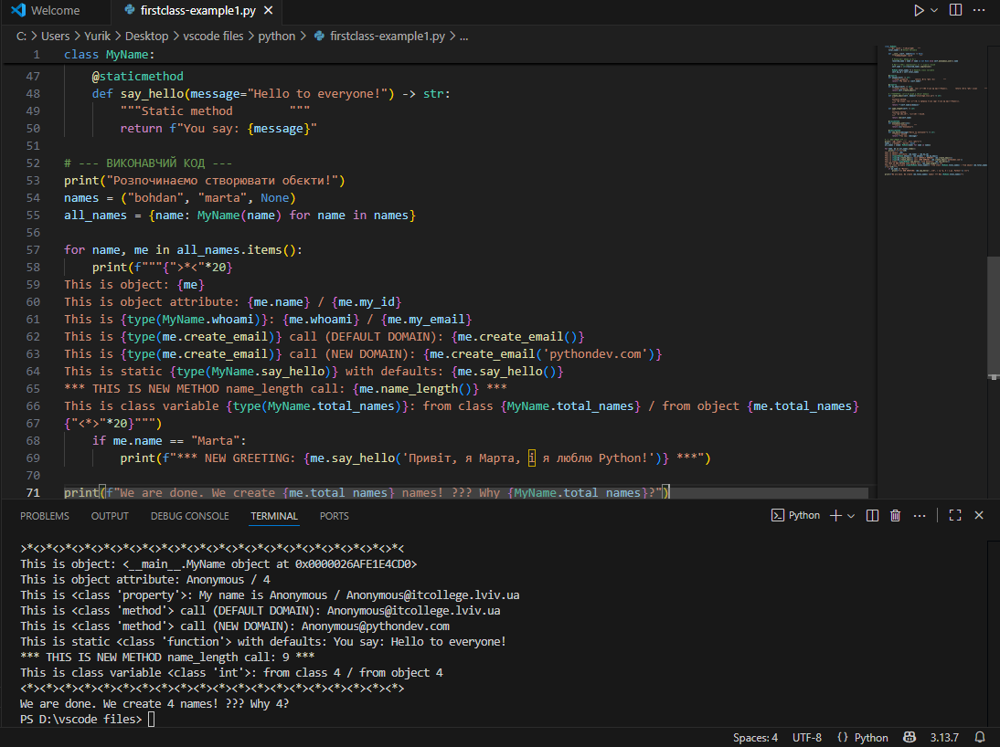
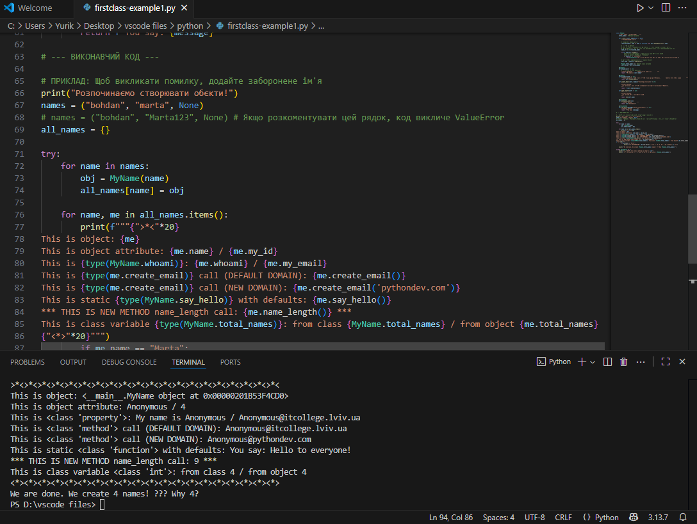
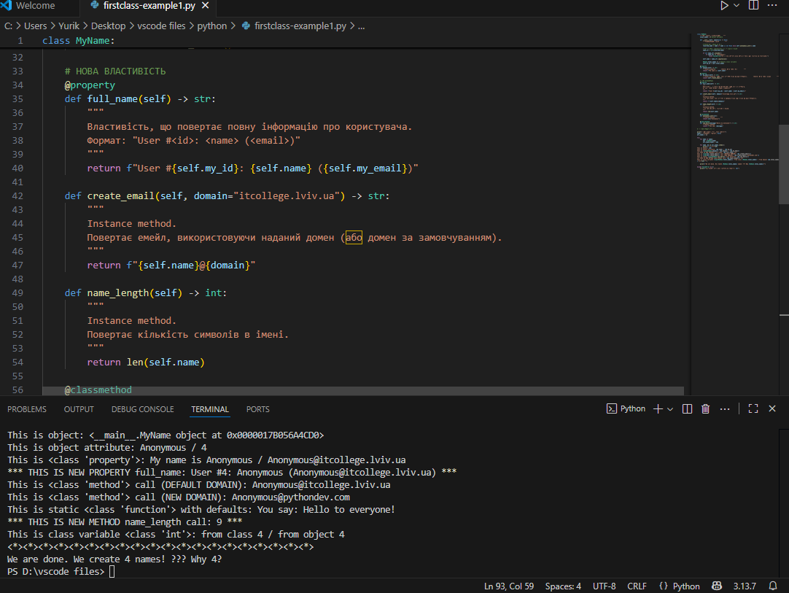
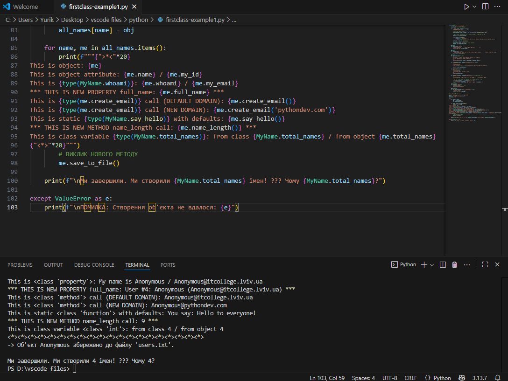

**Звіт до Роботи**

**Тема роботи: Знайомство з ООП**

**Мета роботи:Навчитись використовувати основні принципи ООП, розглянути кострукції побудови класу та створення обєктів та навчитись працювати з ними** 

**1. Виконайте всі завдання описані https://github.com/BobasB/it_college/tree/main/notes/05_OOP_first_class**

**2.Оформіть та здайте роботу. Зразок оформлення можна знайти за
посиланням https://github.com/BobasB/it_college/tree/main/reports**

**3. Вставте посилання на виконану роботу (URL посилання на репозиторій/папку з роботою) у матеріали Завдання або у приватні коментар.**

**Виконання роботи**

**Створюємо перший class**
**Створіть два python файли: для Ноутбука з розширенням .ipynb та для скрипта з розширенням .py;**
**Скопіюйте Python код наведений внизу у Ваш файл з розширенням .py та виконайте його натиснувши Run Python File (трикутник ▶️);**

**Перша програма на ООП**

**1.Вкажіть у звіті що вивела пограма або зробіть скріншот та вставте у звіт;**

**2.Модифікуйте програму додавши своє імя в список;**

**3.Дайте відповідь на запитання та зробіть індивідуальні завдання:**

**Відповіді:**

**I.Пояснення None та Anonymous**
**Об'єкт створюється з іменем "Anonymous" тоді, коли ви передаєте значення None (або взагалі не передаєте аргумент) завдяки логіці, закладеній у методі-конструкторі __init__:**

**1.Конструктор __init__
У коді класу MyName метод __init__ має наступний вигляд:**

**IV.Порахуйте кількість імен у списку names та порівняйте із виведеним результатом. Дайте відповідь чому маємо різну кількість імен?**

**2. Як працює логіка
Розглянемо ключовий рядок:**

**Якщо ви передаєте ім'я (наприклад, "Bohdan"):**
**Умова $`name \text{ is not None}`$ є істинною (True).self.name отримує значення цього імені ("Bohdan").**
**Якщо ви передаєте None (як у вашому списку names) або не передаєте аргумент:**
**Умова $`name \text{ is not None}`$ є хибною (False).Виконується частина else: $`self.anonymous\_user().name`$.**

**3. Метод anonymous_user()**
**Це метод класу (@classmethod), який повертає новий екземпляр класу MyName, викликаючи його з аргументом "Anonymous":**

**Таким чином, коли ви викликаєте $`MyName(None)`$, конструктор бачить None, виконує else, викликає $`self.anonymous\_user()`$, який, у свою чергу, повертає об'єкт, ініціалізований як $`MyName("Anonymous")`$.**

**II.Як змінити текст привітання для say_hello()**
**Метод say_hello() є статичним (@staticmethod) і приймає необов'язковий аргумент message. Щоб змінити текст привітання, потрібно просто передати бажаний рядок як аргумент при виклику цього методу.**

**Доповнення до коду**
**Щоб продемонструвати зміну повідомлення, доповнимо цикл for у кінці вашого коду:**

**Результат виконання нового рядка:**
**Якщо ви запустите об'єкт Marta, виклик $`me.say\_hello('Привіт, я Марта, і я люблю Python!')`$ поверне:You say: Привіт, я Марта, і я люблю Python!**

**III.Допишіть функцію в класі яка порахує кількість букв імені (підказка: використайте функцію len());**

**1.Додаємо метод name_length(self):**

**IV.Порахуйте кількість імен у списку names та порівняйте із виведеним результатом. Дайте відповідь чому маємо різну кількість імен?**

**1.Кількість імен у вихідному списку**
**Вихідний список names містить:$$names = ("Bohdan", "Marta", None)$$**

**2.Кількість імен, створених у коді (total_names)**
**Код виводить:$$We \text{ are done. We create } \mathbf{4} \text{ names!} \text{ ??? Why } \mathbf{4}?$$Значення змінної MyName.total_names дорівнює 4.**

**3.Пояснення: Чому 4, а не 3?**
**Різниця виникає через те, як обробляється елемент None у вашому конструкторі __init__, а саме завдяки виклику методу класу anonymous_user():**

**V.Модифікуйте конструктор init, щоб значення self.name завжди починалося з великої літери, навіть якщо користувач ввів маленьку.;**

**VI.Змініть метод create_email так щоб можна було модифікувати значення після @;**

**VII.Додайте перевірку: якщо ім’я містить цифри або символи, підніміть помилку
ValueError("Ім'я може містити лише літери!").**

**VIII.додайте нову властивість full_name, яка повертає результат у форматі:
"User #<id>: <name> (<email>)"**

**IX.Реалізуйте метод save_to_file(filename="users.txt"), який додає рядок із записом у файл;**

