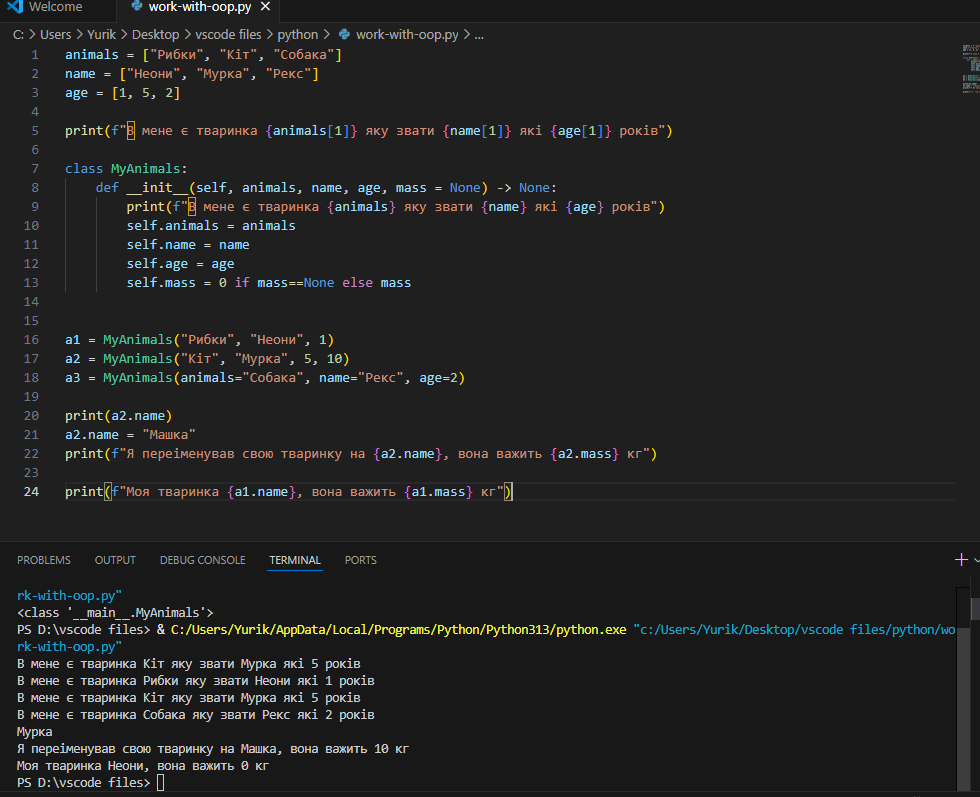
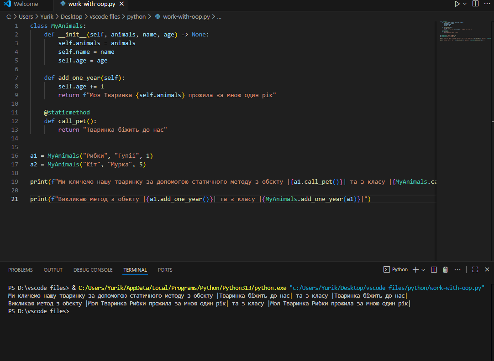
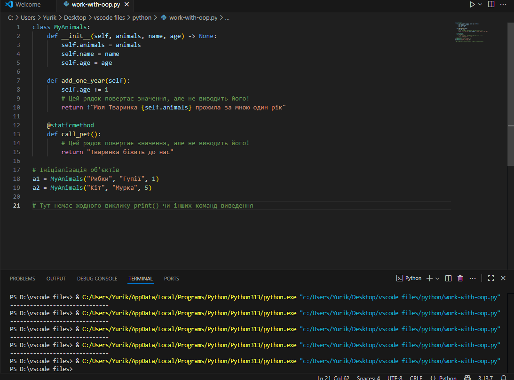
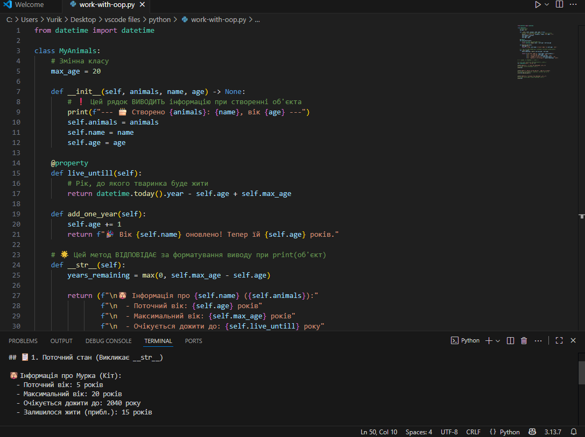

**Звіт до Роботи**

**Тема роботи: Робота з ООП**

**Мета роботи:Мета роботи: Навчитись працювати з Класами та його основними конструкціями** 

**1.Виконайте всі завдання описані https://github.com/BobasB/it_college/tree/main/notes/05_OOP_work_with_classes**

**2.Оформіть та здайте роботу. Зразок оформлення можна знайти за посиланням https://github.com/BobasB/it_college/tree/main/reports**

**3.Вставте посилання на виконану роботу (URL посилання на репозиторій/папку з роботою) у матеріали Завдання або у приватні коментар.**

**Виконання роботи**

**1.Відкрити файл classes.ipynb та виконати всі комірки та завдання;**

**2.Кожна комірка у файлі classes.ipynb має додаткове завдання. Створити нові комірки для виконання кожного із завдань, написати код та виконати комірку з кодом.**

**1.Створюємо базовий клас**

**Вивести тип створененого обєкта**

**2.Порівняння простих даних з обєктами**

**Перейменувати всі обєкти a1-a3 та вивести їх**

**3.Методи класу**

**Застосування методів класу до всіх обєктів a1-a3**

**4.Змінні класу, глобальні змінні над всіма обєктами**

**Задати декілька об'єктів в циклі та вивести глобальну змінну**

**5.Статичні методи та змінна self**

**Викликати статичний метод для кожного обєкта a1-a2**

**6.Робота з properties**

**Додати ще одну properties та вивести її**

**7.Методи Класу**

**Дописати метод класу який буде превіряти що атрибут name заданий з великої букви**

**8.Приватні атрибути та методи**

**9.Магічні методи**

**10.Арифметичні методи**

