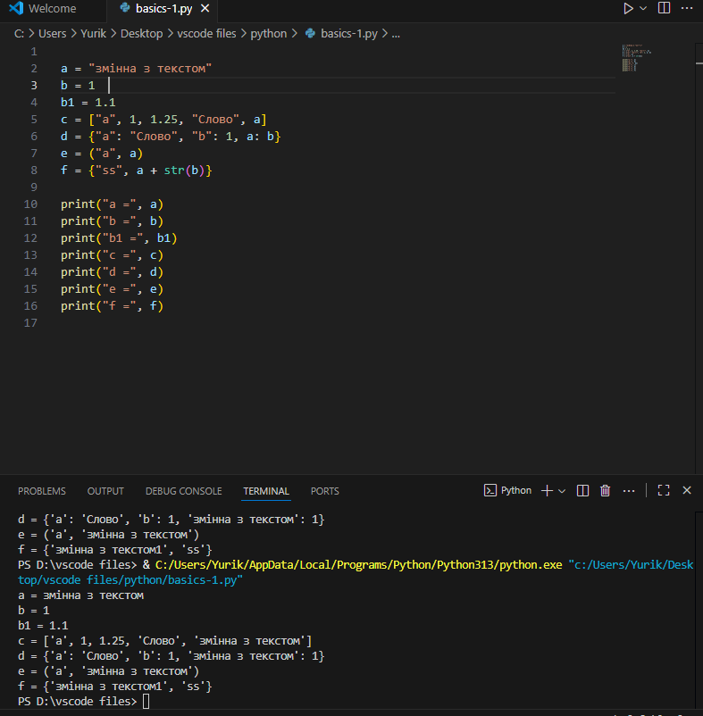
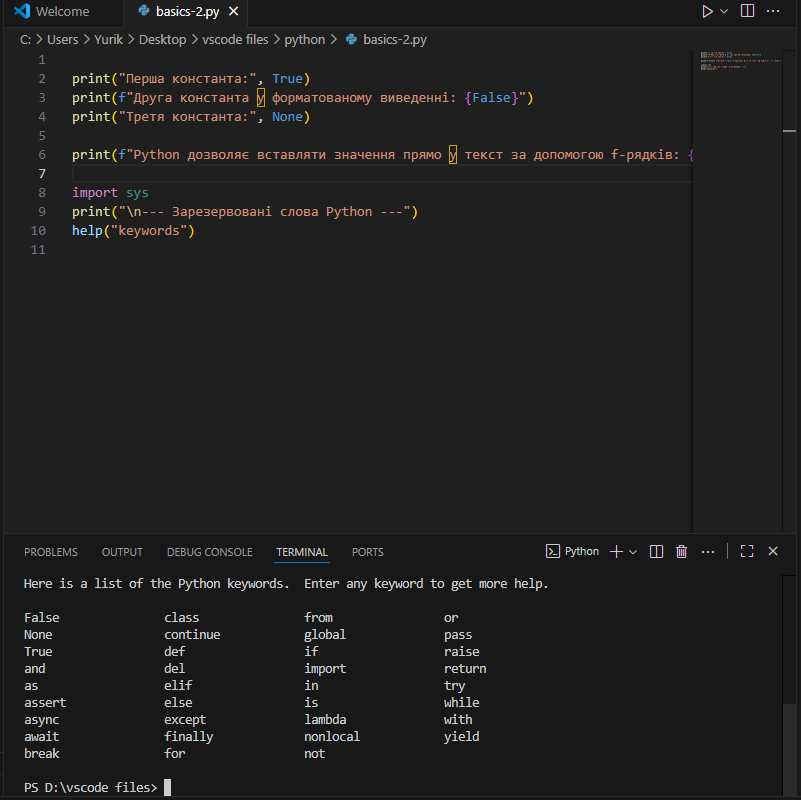
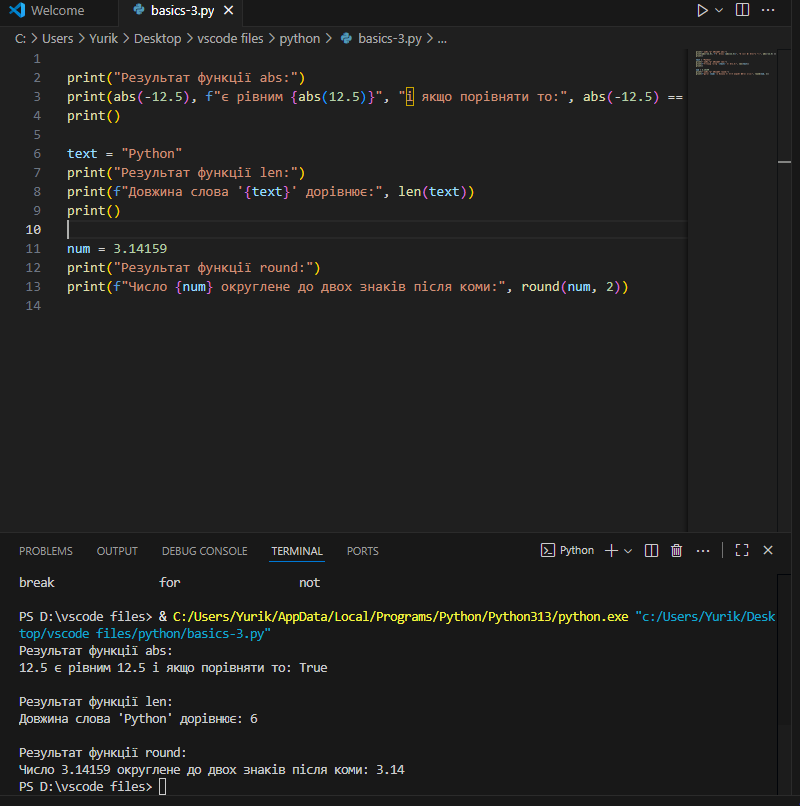
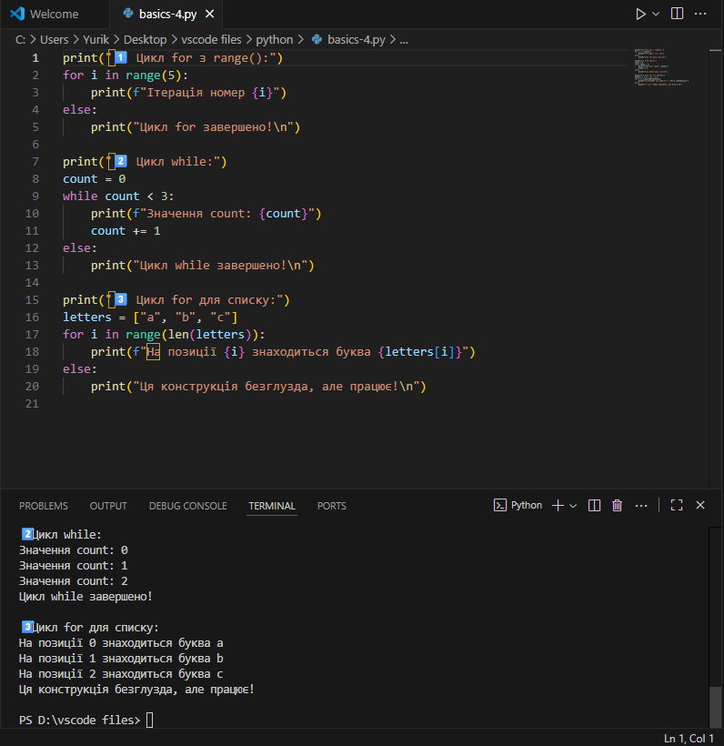
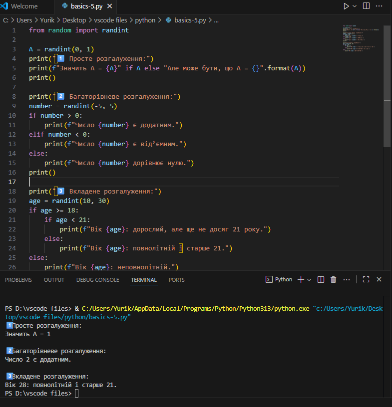
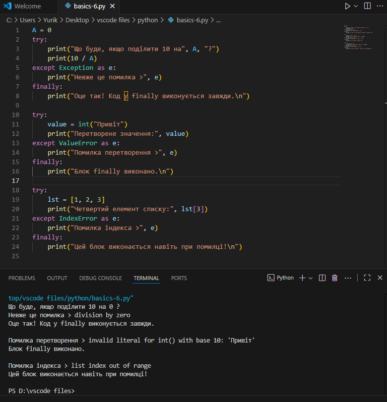
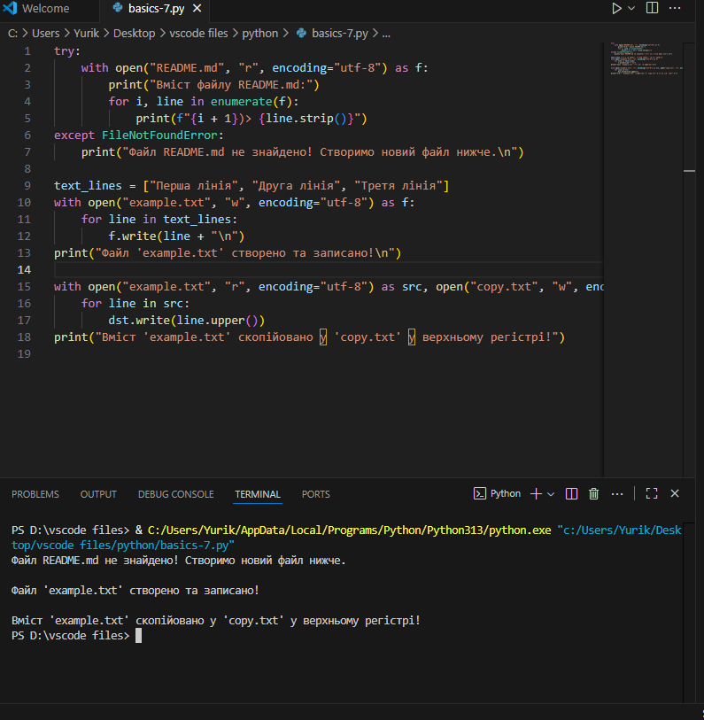
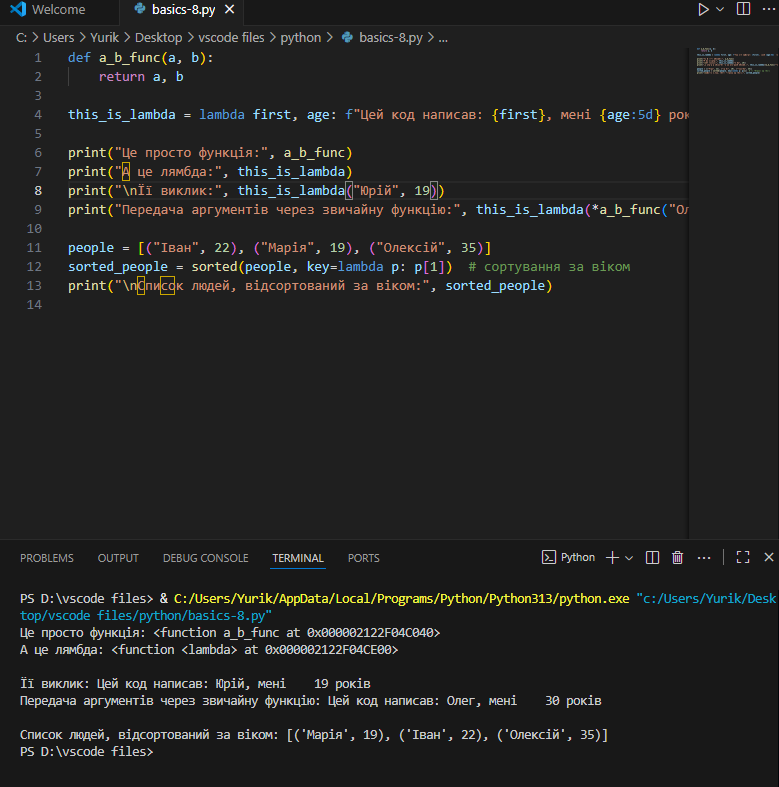
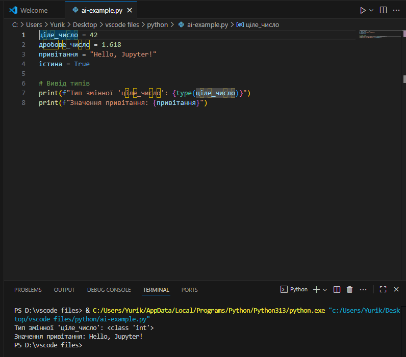

**Звіт до Роботи**

**Тема роботи: Оформлення робіт та перша програма**

**Мета роботи:Навчитись застосовувати основні конструкції мови Python, виконати всі приклади та з використанням AI створити власні приклади які демонструють особливості кодових конструкцій Pyhton** 

**1.Виконайте всі завдання описані https://github.com/BobasB/it_college/tree/main/notes/04_python_basics**

**2. Оформіть та здайте роботу. Зразок оформлення можна знайти за посиланням https://github.com/BobasB/it_college/tree/main/reports**

**3.Створіть Python файл .py або .ipynb в якому будете виконувати базові приклади. Застосовуючи команду print виконайте наступне:**

**Виконання роботи**

**1.Виконайте приклади коду на Python представлені нижче та вставте їх у звіт;**

**Познайомтесь з основними типами даних. Попракитикуйтесь з простими змінними str та int, списками list, наборами set та словниками dict:** 

**Виведіть вбудовані константи, (2-3 на вибір), та зарезервовані слова Python. Наприклад:**

**Виведіть результат роботи вбудованих функцій (2-3 на вибір), наприклад:**

**Познайомтесь з циклами. Напишіть будь-який код який демонструє роботу циклів, (2-3 на вибір), наприклад:**

**Познайомтесь з розгалуженнями. Напишіть будь-який код який демонструє роботу розгалужень, (2-3 на вибір), наприклад:**

**Конструкція try->except->finally. У мові Python код не компілюється, а виконується відразу. Можливі помилки нам треба виловлювати самим. Напишіть свій варіант коду з помилкою. Наприклад:**

**Контекст-менеджер with. Можете почитати тут. Напишіть свій код з контекст-менеджером, наприклад:**

**Познайомтесь з Python lambdas. Напишіть свій приклад коду та як Ви розумієте Лямбди, наприклад:**

**4.Запитайте у АІ як би він розписав про основи Python (задайте промпт вказавши що ви вивчаєте Python з використанням Jupyter Notebook). Спробуйте виконати приклади Python коду та вставте їх відповіді у звіт;**

**Відповідь АІ на це завдання: Оскільки ви вивчаєте Python з використанням Jupyter Notebook, я підготував для вас структурований огляд основних концепцій, який ідеально підходить для інтерактивного вивчення.**

**Ось промпт, який ви можете використовувати:**

**"Я вивчаю Python з використанням Jupyter Notebook. Створіть стислий огляд основ мови, який включає наступні розділи: Змінні та Типи Даних, Основні Оператори, Структури Даних (списки, кортежі, словники, множини), Умовні Оператори (if/elif/else), Цикли (for та while) та Функції. Для кожного розділу наведіть короткий приклад коду."**

**Приклад коду, написаного AI:**

